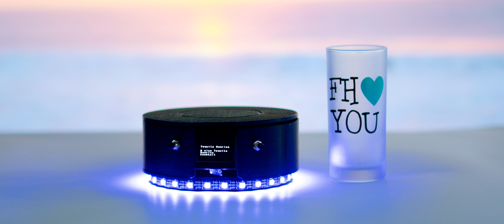
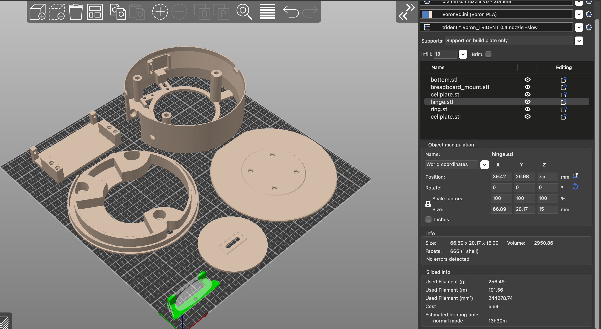
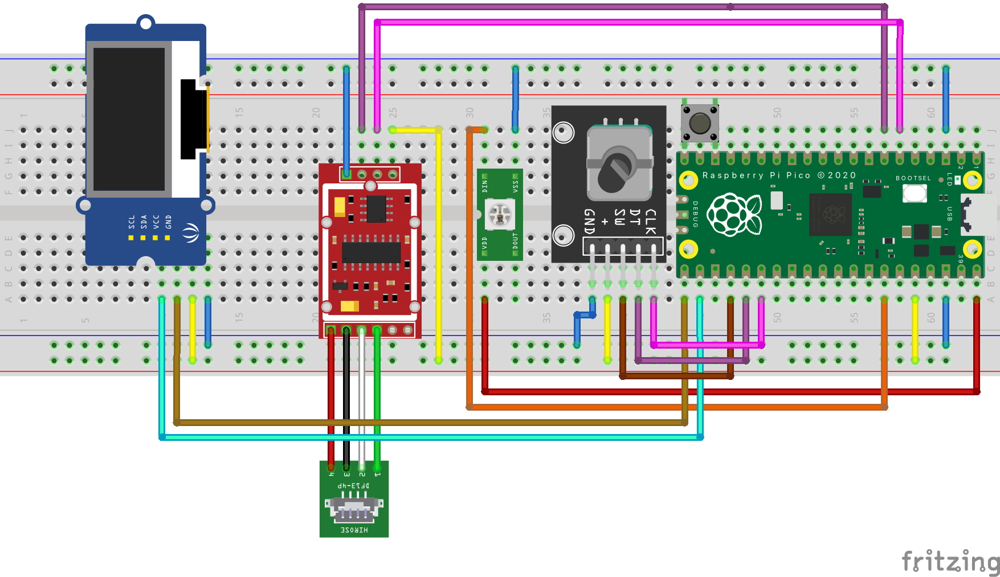
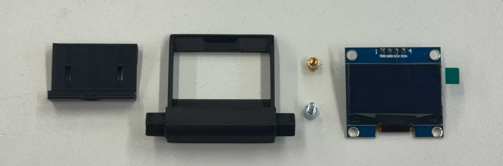
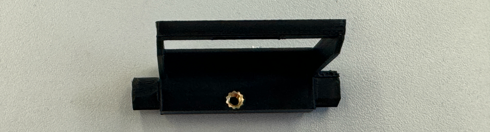
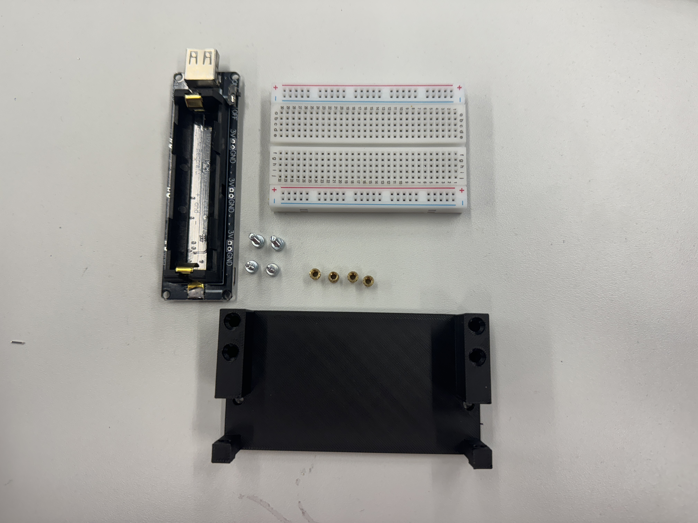
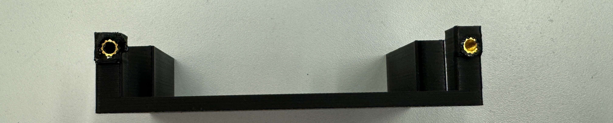
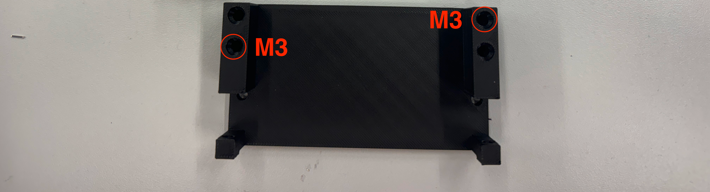
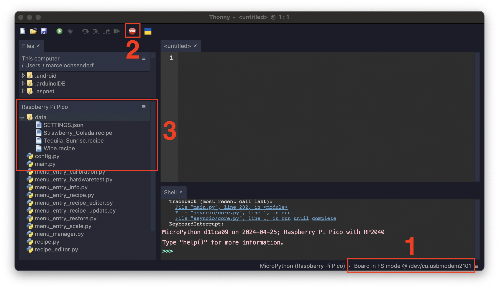

# MixMeasureBuddy



MixMeasureBuddy's smart cocktail scale revolutionizes home bartending by offering accurate ingredient measurements and a vast library of cocktail recipes personalized to your liquor collection. Enjoy the art of mixology with ease and precision.

Discover the advanced features that set MixMeasureBuddy apart from traditional kitchen scales.


## FEATURES

Discover the advanced features that set MixMeasureBuddy apart from traditional kitchen scales:

* **Open-Source** MixMeasureBuddy is 100% open-source and can be build using a few simple and cheap parts.
* **Connectivity Features** Enjoy seamless integration with a companion webapp for sharing personalized cocktail recipes with other MixMeasureBuddy owners.
* **Offline Usage** Recipes are stored offline and locally on the MixMeasureBerry and can be edited using a text editor
* **User-Friendly Interface** Easily navigate the scale's intuitive interface for effortless cocktail making.
* **Customizable Recipes** Access a plethora of cocktail recipes tailored to your liquor cabinet for endless mixing possibilities.
* **Precision Measurements** Eliminate the guesswork and achieve consistent results with exact ingredient measurements every time.


## BOM


### 3D PRINTED PARTS

* 1x `ring.stl`
* 1x `breadboard_mount.stl`
* 1x `inner_cellplate.stl`
* 1x `cellplate.stl`
* 1x `hinge.stl`
* 1x `bottom.stl`
* 1x `display_clamp_SH1106`
* 1x `display_mount_SH1106`
  
#### 3D PRINT SETTINGS

* Layer height: `0.2` - `0.3`mm
* Support: `Support on buildplate only`
* Inflill: `20%`




### MECHANICAL

* 6x `Heat Inserts M3`
* 6x `M3x10 BHCS`
* 4x `M4x10 BHCS` - depends on load cell screw threads
* 3x `Heat Inserts M5`
* 3x `M5x10 SHCS`
* 8x `Cylindrical Magnet D5mm H8mm`

### MISC

* `Super Glue` - to glue magnets into `inner_cellplate` and `cellplate`

### ELECTRICAL

* 1x `Raspberry Pi Pico` or `Raspberry Pi Pico W`
* 1x `LOAD CELL` with dimensions of `60x12x12mm` and at least `2kg`, for example `YZC-131`
* 1x `HX711`
* 1x `1.3" I2C OLED SSH1306`
* 1x `Encoder` e.g. `KY-040`
* 50cm `WS2812` strip
* Jumperwires  >12x `male-male`, >10x `male-female`
* 1x Breadboard with dimensions of `83 x 55mm`, for example `Mini Breadboard 400 Pin`
* [OPTIONAL] `SPI SD TF Karte Memory Card Shield Modul`
* [OPTIONAL] `Battery Expansion Shield 18650 V3`

### TOOLS

* `Soldering Iron`
* `Hotglue`

# HARDWARE BUILD

## SCHEMATIC

The following diagram shows the internal wiring of the individual components of the `MixMeasureBuddy`.
Only the `Raspberry Pi Pico`, button and the `HX711` are placed on the small breadboard.
The display, `LEDs` and the encoder(-module) are connected with longer cables so that they can be attached to the 3D printed parts at the intended mounting locations.



The circuit diagram was created in the Fritzing software. The project can be found under `documenation/schematic/`.
After the function of all parts has been tested, the connections on the breadboard should be fixed with hot glue so that they do not come loose during transportation.

## NOTES

To fix accuracy issues on several `HX711` boards, two addional resistors are needed.
Please refer to this guide: [HX711 – Auswahl und Beschaltung](https://beelogger.de/sensoren/waegezellen_hx711/hx711_beschaltung/#:~:text=HX711%20Modul%20Auswahl,Wägezelle%20und%20einen%20einstellbaren%20Messbrückenverstärker.)

### [OPTIONAL] SD CARD READER

It is possible to connect an additional SD card reader. This makes it possible to save the recipes on an SD card.  
Please connect the SD card reader to the following pins on the `Raspberry Pi Pico`:

| Raspberry Pi Pico GPIO | SD CARD MODULE GPIO |
|------------------------|---------------------|
| VCC (Pin 36)           | 3v3 OUT / VCC       |
| GND (Pin 18)           | GND                 |
| 10                     | SCK                 |
| 8                      | MISO                |
| 11                     | MOSI                |
| 9                      | CS                  |

No further software changes are needed later on. The systems firmware detects the connected SD card automatically.

### [OPTIONAL] BATTERY EXPANSION

The `Battery Expansion Shield 18650 V3` can be mounted on the `breadboard_mount.stl` later on.
In oder to connect the `Battery Expansion` to the `Raspberry Pi Pico GPIO` please follow the wiring table below:

| Raspberry Pi Pico GPIO | Battery Expansion |
|------------------------|-------------------|
| VBUS (Pin 40)          | 5V OUT            |
| GND                    | GND               |


## SOFTWARE INSTALLATION

Please check the `Releases` page of this repository for prebuild firmware archives.

To initially flash the software to the `Raspberry Pi Pico`, the `BOOT` button must first be held down when plugging in the `USB` cable.
A new removable disk will then appear on the `PC`. The `firmware.uf2` is then copied to this.
The microcontroller will then restart and the MixMeasureBuddy logo should appear on the display.

If you want to build the software yourself from source or add modifications, please refer to the `SOFTWARE DEVELOPMENT` chapter.

### SOFTWARE UPGRADE

If a old version of the firmwre was already installed on the `Raspberry Pi Pico`, please flash the [flash_nuke.uf2](https://github.com/dwelch67/raspberrypi-pico/blob/main/flash_nuke.uf2) first! This clears all user settings!

**NOTE** Please backup all your stored recipes first!


## MECHANICAL BUILD


### 1. DISPLAY MOUNT



The first step is to assemble the display and its mounting together. For this step the following parts are needed:

* 1x `Heat Inserts M3`
* 1x `M3x10 BHCS`
* 1x `1.3" I2C OLED SSH1306`
* 4x Jumperwires `male-female`
* 1x `display_clamp_SH1106`
* 1x `display_mount_SH1106`

#### INSTRUCTIONS



1. Insert the `M3 Heat Insert` using a soldering iron into `display_mount_SH1106`
2. Place the `1.3" I2C OLED SSH1306` display inside `display_mount_SH1106`.
3. Press the display into the frame using the `display_clamp_SH1106` and one `M3x10 BHCS`
4. Connect four `male-female` jumperwires onto the display header
5. Glue the jumperwire ends and the header together using a drop of hotgleue
6. [OPTIONAL] Lock down the jumperwires using a small zip-tie


### 2. PREPARE BODY

The next step is to prepare the body parts with needed heat inserts and mount the display assembly.
For this part the following parts are needed:

* 1x `Heat Insert M3`
* 1x `M3x10 BHCS`
* 3x `Heat Insert M5`
* 1x `DISPLAY ASSEMBLY` from previous step
* 1x `bottom.stl`
* 1x `hinge.stl`

#### INSTRUCTIONS

1. Insert the 1x `M3 Heat Insert`, 3x `M5 Heat Insert` using a soldering iron into `bottom`


2. Insert the `DISPLAY ASSEMBLY` as shown in picture below.
3. Fix the `DISPLAY ASSEMBLY` using the `hinge.stl` and `M3x10 BHCS` screw into the `M3 Heat Insert`


### 3. ELECTRONICS BAY



* 4x `Heat Insert M3`
* 2x `M3x10 BHCS`
* 1x `breadboard_mount.stl`
* [OPTIONAL] `Battery Expansion Shield 18650 V3`
* 1x Breadboard with dimensions of `83 x 55mm`, for example `Mini Breadboard 400 Pin`

#### INSTRUCTIONS

1. Insert the 2x `M3 Heat Insert` into the side of the `breadboard_mount.stl`
2. [OPTIONAL] Screw the `Battery Expansion Shield 18650 V3` into the side



3. Insert the 2x `M3 Heat Insert` into the top of the `breadboard_mount.stl`



3. Remove the protective film from the breadboard bottom side and place it ontop `breadboard_mount.stl`


### 4. LOAD CELL

* 2x `M3x10 BHCS`
* 4x `M4x10 BHCS` - depends on load cell screw threads
* 1x `inner_cellplate.stl`
* 4x `Cylindrical Magnet D5mm H8mm`
* 1x `LOAD CELL`
* 1x `Enoder`

* 1x `PREPARED BODY` ASSEMBLY
* 1x `PREPARED ELECTRONICS BAY` ASSEMBLY

#### INSTRUCTIONS

1. Scre the loadcell using two `M4x10 BHCS` screws into the `bottom.stl` as shown in the picture below:
**NOTE** The cables from the load cell are facing towards the shell of the `bottom.stl`


2. Screw the `Encoder` into one of the holes next to the display assembly.
3. Connect five jumperwires `male-female`to the headers


4. Place the `PREPARED ELECTRONICS BAY` assembly onto of the load cell.


5. Use two `M3x10 BHCS` screws to secure the `PREPARED ELECTRONICS BAY` assembly from the other side (top) of the `bottom.stl`


6. Use the remaining `M4x10 BHCS` screws to mount the `inner_cellplate.stl` on the load cell arm, in the center of the `bottom.stl` cutout


**NOTE** Please connect all remaining components (`Encoder`, `Display`, ...) to the breadboard. See chapter `SCHEMATIC` again.
**NOTE** Its a good time to test the electronics again! Please refer to the `SOFTWARE INSTALLATION` chapter.


### 6. FINAL ASSEMBLY


The last assembly step is to add the led ring and prepare the top scale plate.

* 1x `ring.stl`
* 50cm `WS2812` strip
* 3x `M5x10 SHCS`
* 8x `Cylindrical Magnet D5mm H8mm`
* 3x  Jumperwire `male-male`

#### INSTRUCTIONS

**NOTE** If no `Battery Expansion Shield 18650 V3` is installed, please insert a `Micro USB` cable into the `Raspberry Pi Pico` before attaching the `ring.stl`

1. Solder the three `male-male` jumperwires on the `WS2812` strip
2. Remove the protective film from the `WS2812` strip and place them into the notch of the `ring.stl`


2. Glue four magnets into `inner_cellplate.stl`


3. Glue four magnets into the `cellplate.stl` with opposite orientation as in the `inner_cellplate.stl`


4. Screw the `ring.stl` using the three `M5x10 SHCS` screws onto `bottom.stl` assembly.
**NOTE** Make sure that the `Micro USB` is going thought opening between `bottom.stl`  and `ring.stl`

5. Place the `cellplate.stl` ontop of the  `inner_cellplate.stl`


# USAGE

Once the hardware has been set up and the software has been flashed to the microcontroller, the system can be set up for the first time.
The basic operation and calibration of the system is described below.

## MENU NAVIGATION

After switching on the power supply, e.g. via a power bank, the main menu appears on the display immediately after the logo screen.
Navigation in the system is very easy thanks to the rotary encoder. 
The right and left rotation of the encoder can be used to scroll through the separate menu entries.
If you want to enter / activate a menu item, simply press the button on the encoder.
To exit a menu/recipe, the encoder button must be held down for at least half a second.

## CALIBRATION

If the scales menu or a recipe is now called up. The weighing results can deviate significantly from reality.
This is due to the installation direction of the load cell, its mounting and other factors.
The menu item `CALIBRATION` is provided for this purpose.
For this process, the scale is measured with and without weight and the corresponding correction factors are determined.

A known weight with at least `50g` is therefore required. This can be a glass of water, for example, which has previously been measured with a kitchen scale.

After starting the calibration routine, the user is guided through the following steps one after the other:

* Measure empty scale
* User enters weight of calibration object
* User places calibration object on scale
* User removes calibration object if shown by display

**NOTE** If the scales light up red, please do not move them.

**NOTE** The IKEA POKAL glass has a weight of 390g (empty)

## RUN A RECIPE


## ADDING CUSTOM RECIPES

A recipe in the context of the MixMeasureBuddy consists of a JSON object in a .recipe file. This contains meta data such as the name and description of the recipe as well as a series of instructions that the user should execute to complete the recipe. The following instruction types can be used for this purpose:

* SCALE - Weigh until x grams reached
* WAIT - Wait x seconds
* CONFIRM - Confirm that it has been done.


There are two ways to create a new recipe manually:

### BY USING recipe.py CLASS

```python
# SEE example_recipes.py FOR FURTHER / DETAILED EXAMPLES
import recipe

example_recipe: recipe.recipe = recipe.recipe("Tequila Sunrise", "A nice Tequila Sunrise Cocktail", "1.0.0", ["Tequila"])
# ADD A SCALE STEP: ADD x g TO THE GLASS
example_recipe.add_step(recipe.recipe_step(_action=recipe.USER_INTERACTION_MODE.SCALE, _ingredient_name="White Tequila", _current_step_text="", _target_value = 10))
# ADD A SCALE STEP: ADD x g TO THE GLASS
example_recipe.add_step(recipe.recipe_step(_action=recipe.USER_INTERACTION_MODE.SCALE, _ingredient_name="Orange Juice", _current_step_text="", _target_value = 120))
# ADD CONFIRM STEP: ADD ICE AND CONFIRM WITH A BUTTON PRESS
example_recipe.add_step(recipe.recipe_step(_action=recipe.USER_INTERACTION_MODE.CONFIRM, _ingredient_name="Ice", _current_step_text="Add Ice", _target_value = -1))
# ADD A SCALE STEP: ADD x g TO THE GLASS
example_recipe.add_step(recipe.recipe_step(_action=recipe.USER_INTERACTION_MODE.SCALE, _ingredient_name="Grenadine", _current_step_text="", _target_value = 40))
# ADD A WAIT STEP:  WAIT x SECONDS
example_recipe.add_step(recipe.recipe_step(_action=recipe.USER_INTERACTION_MODE.WAIT, _ingredient_name="", _current_step_text="Wait for settle down", _target_value = 10))


# EXPORT THE RECIPES AS JSON BASE .RECIPE FILE
with open("recipe.recipe, "w") as file:
  file.write(json.dumps(example_recipe.to_dict()))
# THEN ITS POSSIBLE TO COPY OVER THE .RECIPE FILE TO THE SCALE

```


### CREATEING A JSON BASED .recipe FILE

```json
{
    "filename": "Tequila_Sunrise.recipe",
    "name": "Tequila Sunrise",
    "steps": [{
        "text": "",
        "ingredient": "White Tequila",
        "amount": 10,
        "action": 0
    }, {
        "text": "",
        "ingredient": "Orange Juice",
        "amount": 120,
        "action": 0
    }, {
        "text": "Add Ice",
        "ingredient": "Ice",
        "amount": -1,
        "action": 1
    }, {
        "text": "",
        "ingredient": "Grenadine",
        "amount": 40,
        "action": 0
    }, {
        "text": "Wait for settle down",
        "ingredient": "",
        "amount": 10,
        "action": 2
    }],
    "description": "A nice Tequila Sunrise Cocktail",
    "version": "1.0.0"
}
```

### COPY RECIPES TO SCALE

To access the files and the Micropython environment on the scale directly, its possible to use these two example programs below:

* [Thonny](https://github.com/thonny/thonny/)
* [rshell](https://github.com/dhylands/rshell)

In this example, a previously created recipe file is to be copied to the `MixMeasureBuddy` so that it can be used.
After connecting the flashed `MixMeasureBuddy` to a host PC using a USB cable, run the following commands in order to transfer the `.recipe` file.

#### THONNY

For installation, please refer to the installation guid on the website [INSTALL_THONNY](https://thonny.org).



The image shows the steps in order to connect the `MixMeasureBuddy` and access its files:

1. Select the board
2. Connect to python repl running on the board
3. Use the file explorer to add/edit/remove files 

#### RSHELL


```bash
# INSTALL RSHELL
$ sudo pip3 install rshell

#TEST CONNECTION
$ rshell
# OR
$ rshell -p /dev/ttyUSB0
# COPY
$ rshell cp MyRecipe.recipe /data/MyRecipe.recipe
```

The recipe is now stored on the `MixMeasureBuddy`. Powercycle the device to load the new recipes!

### USER CONFIGURATION

If a `Raspberry Pi Pico W` is used, its possible to use the recipe editor and the recipe api update functions.
Here the wifi credentials needs to be set using the `SETTINGS.json` file on the scale.
Please use the same procedure described above to edit files on the scale filesystem.


# SOFTWARE DEVELOPMENT

The microcontroller firmware of the `Raspberry Pi Pico` was created in micropython and is automatically created with the pre-built image. 
The source code files are located in the folder `src/firmware_rp2040` and the Python source code files in the folder `src/firmware_rp2040/src`.
The program `Thonny` can be used to adapt the software directly on the scale.


## DIFFERENT HARDWARE CONFIG

The global hardware configuration (used display type, pin definitions and other settings) are stored in the `Config.py` loacted in the virtual filesystem.
Its possbile to modify this file using the `REPL` or` Thonny` as described above.


## STRUCTURE

The entry point of the software is in the `main.py`, which is called by the custom pre-boot script `boot.py`. The general configuration of the hardware (e.g. which pins the buttons are connected to) is done in the `config.py` file.

The control of the hardware components is done in the files:

* `ui.py` - UI system + display control
* `ledring.py` - LED effects for the LED ring
* `Scales.py` - readout of the HX711
* `settings.py`- filesystem access for writing/reading recipe files and settings

All these classes can be easily called from all other scripts using the singleton pattern. This makes integration very simple and uniform:

```python
import ledring
import ui
import Scale
# CLEAR DISPLAY
ui().clear()
# SET LED RING
ledring().set_neopixel_full_hsv(ledring().COLOR_PRESET_HSV_H__BLUE)
# GET CURRENT SCALE MEASUREMENT
ScaleInterface().get_current_weight()
```

The individual menus are designed as a plug-in system. This allows you to quickly create your own extensions.
The plugins are designated in the system with the prefix `menu_entry_*.py` and the functions are derived from the base class `menu_entry.py`.
This consists of an `activate`, `teardown` and `update` function, which are called accordingly when the corresponding menu entry is called.

```python
class menu_entry_MyPlugin(menu_entry.menu_entry):

    def __init__(self):
        super().__init__("MyPlugin", "My nice plugin")
    # WILL BE CALLED IF USER SELECTS PLUGIN
    def preview(self):
        print("preview {}".format(self.name))
        ui().show_recipe_information(self.name, self.description)
    
    # WILL BE CALLED IF USER ACTIVATES PLUGIN
    # E.G. DO SETUP STUFF
    def activate(self):
        print("activate {}".format(self.name))
        ui().show_titlescreen()

    # WILL BE CALLED IF USER EXISTS PLUGIN
    # E.G. DELETE RESOURCES
    def teardown(self):
        print("teardown {}".format(self.name))

    # WILL BE CALLED IF A USER PRESSES A BUTTON, EVERY SECOND OR IF THE WEIGHT ON LOAD CELL CHANGES
    def update(self, _system_command: system_command.system_command):
        
        if _system_command.type == system_command.system_command.COMMAND_TYPE_NAVIGATION:
            if _system_command.action == system_command.system_command.NAVIGATION_ENTER: #  OK BUTTON
                pass
            elif _system_command.action == system_command.system_command.NAVIGATION_LEFT: # NEXT BUTTON
                pass
            elif _system_command.action == system_command.system_command.NAVIGATION_RIGHT: # PREV BUTTON
                pass

        elif _system_command.type == system_command.system_command.COMMAND_TYPE_SCALE:
              print("CURRENT WEIGHT: {}".format(_system_command.value))
  
        elif _system_command.type == system_command.system_command.COMMAND_TYPE_TIMER_IRQ:
              print("ELAPSED TIME SINCE LAST CALL: {}".format(_system_command.value))
           
```


To add the plugin, import the module in `main.py` and add the class into the menu tree:

```python
from menu_entry_MyPlugin import menu_entry_MyPlugin
menu_manager.menu_manager().add_subentries(menu_entry_MyPlugin.menu_entry_MyPlugin())
```


## FIRMWARE IMAGE

To create a finished and complete firmware image, the folder `src/firmware_rp2040` contains a bash script which creates the images using `Docker` for the `Raspberry Pi Pico` and `Raspberry Pi Pico W` and the required boot configurations.

```bash
# INSTALL AND RUN DOCKER https://docs.docker.com/engine/install/
$ cd src/firmware_rp2040
$ bash ./build_firmware_docker.sh
# RESULTS ARE LOCATED IN THE build FOLDER
```

## BUILD SYSTEM BACKGROUND

One problem was how to build and distribute the Micropython images automatically via e.g. GitHub.
The way documented by Micropython does not allow the user to change the code and data after building the u2f, because they are permanently written to the flash (static/lib) fodlers.
That's why the complicated build process was created using a Docker image that installs a pre application boot procedure, so that the user source code to the Python file system during the first boot.
This way, functions can be easily added/modified by the user and at the same time the finished software can be easily distributed.
