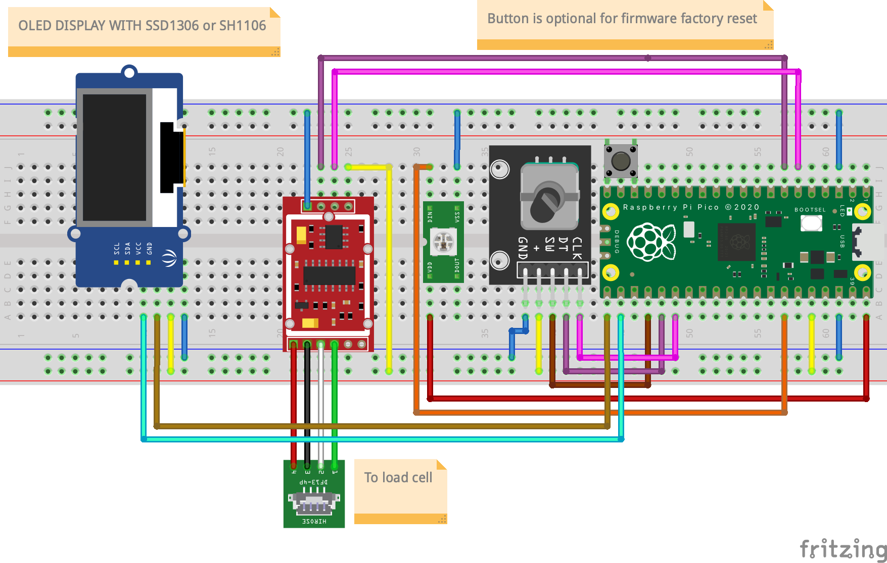

# CocktailScaler


MixMeasureBuddy's smart cocktail scale revolutionizes home bartending by offering accurate ingredient measurements and a vast library of cocktail recipes personalized to your liquor collection. Enjoy the art of mixology with ease and precision.

Discover the advanced features that set MixMeasureBuddy apart from traditional kitchen scales.


## FEATURES

Discover the advanced features that set MixMeasureBuddy apart from traditional kitchen scales:

* **Open-Source** MixMeasureBuddy is 100% open-source and can be build using a few simple and cheap parts.
* **Connectivity Features** Enjoy seamless integration with a companion webapp for sharing personalized cocktail recipes with other MixMeasureBuddy owners.
* **Offline Usage** Recipes are stored offline and locally on the MixMeasureBerry and can be edited using a text editor
* **User-Friendly Interface** Easily navigate the scale's intuitive interface for effortless cocktail making.
* **Customizable Recipes** Access a plethora of cocktail recipes tailored to your liquor cabinet for endless mixing possibilities.
* **Precision Measurements** Eliminate the guesswork and achieve consistent results with exact ingredient measurements every time.


## BOM


### 3D PRINTED PARTS

* 1x `ring.stl`
* 1x `breadboard_mount.stl`
* * 1x `inner_cellplate.stl`
* 1x `cellplate.stl`
* 1x `hinge.stl`
* 1x `bottom.stl`
* 1x `display_clamp_SH1106`
* 1x `display_mount_SH1106`
  


#### 3D PRINT SETTINGS

* Layer height: `0.2` - `0.3`mm
* Support: `Support on buildplate only`
* Inflill: `20%`


### MECHANICAL

* 3x `Heat Inserts M3` - connects `display_clamp` and `display_mount`
* 3x `M3x10 BHCS`

* 3x `Heat Inserts M3`, `Heat Inserts M4` or `Heat Inserts M5` - connects `ring` and `bottom`
* 3x `M3x10 SHCS`, `M4x10 SHCS` or `M5x10 SHCS`
  
* 8x `Cylindrical Magnet D5mm H8mm`

### MISC

* `Super Glue` - to glue magnets into `inner_cellplate` and `cellplate`


### ELECTRICAL

* 1x `Raspberry Pi Pico` or `Raspberry Pi Pico W`
* 1x `LOAD CELL` with dimensions of `60x12x12mm` and at least `2kg`, for example `YZC-131`
* 1x `HX711`
* 1x `1.3" I2C OLED SSH1306`
* 1x `Encoder` e.g. `KY-040`
* 50cm `WS2812` strip
* Jumperwires - > 12x `male-male`, > 10x `male-female`
* 1x Breadboard with dimensions of `83 x 55mm`, for example `Mini Breadboard 400 Pin`


# HARDWARE BUILD

## SCHEMATIC

The following diagram shows the internal wiring of the individual components of the `MixMeasureBuddy`.
Only the `Raspberry Pi Pico`, button and the `HX711` are placed on the small breadboard.
The display, `LEDs` and the encoder(-module) are connected with longer cables so that they can be attached to the 3D printed parts at the intended mounting locations.



The circuit diagram was created in the Fritzing software. The project can be found under `documenation/schematic/`.
After the function of all parts has been tested, the connections on the breadboard should be fixed with hot glue so that they do not come loose during transportation.

## MECHANICAL BUILD

### DISPLAY MOUNT


### ELECTRONICS BAY

### LOAD CELL

### FINAL ASSEMBLY

## NOTES

To fix accuracy issues on several `HX711` boards, two addional resistors are needed.
Please refer to this guide: [HX711 – Auswahl und Beschaltung](https://beelogger.de/sensoren/waegezellen_hx711/hx711_beschaltung/#:~:text=HX711%20Modul%20Auswahl,Wägezelle%20und%20einen%20einstellbaren%20Messbrückenverstärker.)


# SOFTWARE BUILD

Please check the `Releases` page of this repository for prebuild firmware archives.

To initially flash the software to the `Raspberry Pi Pico`, the `BOOT` button must first be held down when plugging in the `USB` cable.
A new removable disk will then appear on the `PC`. The `firmware.uf2` is then copied to this.
The microcontroller will then restart and the MixMeasureBuddy logo should appear on the display.


## DEVELOPMENT

The microcontroller firmware of the `Raspberry Pi Pico` was created in micropython and is automatically created with the pre-built image. 
The source code files are located in the folder `src/firmware_rp2040` and the Python source code files in the folder `src/firmware_rp2040/src`.
The program `Thonny` can be used to adapt the software directly on the scale.

### STRUCTURE

The entry point of the software is in the `main.py`, which is called by the custom pre-boot script `boot.py`. The general configuration of the hardware (e.g. which pins the buttons are connected to) is done in the `config.py` file.

The control of the hardware components is done in the files:

* `ui.py` - UI system + display control
* `ledring.py` - LED effects for the LED ring
* `Scales.py` - readout of the HX711
* `settings.py`- filesystem access for writing/reading recipe files and settings

All these classes can be easily called from all other scripts using the singleton pattern. This makes integration very simple and uniform:

```python
import ledring
import ui
import Scale
# CLEAR DISPLAY
ui().clear()
# SET LED RING
ledring().set_neopixel_full_hsv(ledring().COLOR_PRESET_HSV_H__BLUE)
# GET CURRENT SCALE MEASUREMENT
ScaleInterface().get_current_weight()
```

The individual menus are designed as a plug-in system. This allows you to quickly create your own extensions.
The plugins are designated in the system with the prefix `menu_entry_*.py` and the functions are derived from the base class `menu_entry.py`.
This consists of an `activate`, `teardown` and `update` function, which are called accordingly when the corresponding menu entry is called.

```python
class menu_entry_MyPlugin(menu_entry.menu_entry):

    def __init__(self):
        super().__init__("MyPlugin", "My nice plugin")
    # WILL BE CALLED IF USER SELECTS PLUGIN
    def preview(self):
        print("preview {}".format(self.name))
        ui().show_recipe_information(self.name, self.description)
    
    # WILL BE CALLED IF USER ACTIVATES PLUGIN
    # E.G. DO SETUP STUFF
    def activate(self):
        print("activate {}".format(self.name))
        ui().show_titlescreen()

    # WILL BE CALLED IF USER EXISTS PLUGIN
    # E.G. DELETE RESOURCES
    def teardown(self):
        print("teardown {}".format(self.name))

    # WILL BE CALLED IF A USER PRESSES A BUTTON, EVERY SECOND OR IF THE WEIGHT ON LOAD CELL CHANGES
    def update(self, _system_command: system_command.system_command):
        
        if _system_command.type == system_command.system_command.COMMAND_TYPE_NAVIGATION:
            if _system_command.action == system_command.system_command.NAVIGATION_ENTER: #  OK BUTTON
                pass
            elif _system_command.action == system_command.system_command.NAVIGATION_LEFT: # NEXT BUTTON
                pass
            elif _system_command.action == system_command.system_command.NAVIGATION_RIGHT: # PREV BUTTON
                pass

      elif _system_command.type == system_command.system_command.COMMAND_TYPE_SCALE:
            print("CURRENT WEIGHT: {}".format(_system_command.value))

      elif _system_command.type == system_command.system_command.COMMAND_TYPE_TIMER_IRQ:
            print("ELAPSED TIME SINCE LAST CALL: {}".format(_system_command.value))
           
```


To add the plugin, import the module in `main.py` and add the class into the menu tree:

```python
from menu_entry_MyPlugin import menu_entry_MyPlugin
menu_manager.menu_manager().add_subentries(menu_entry_MyPlugin.menu_entry_MyPlugin())
```


### FIRMWARE IMAGE

To create a finished and complete firmware image, the folder `src/firmware_rp2040` contains a bash script which creates the images using `Docker` for the `Raspberry Pi Pico` and `Raspberry Pi Pico W` and the required boot configurations.

```bash
# INSTALL AND RUN DOCKER https://docs.docker.com/engine/install/
$ cd src/firmware_rp2040
$ bash ./build_firmware_docker.sh
# RESULTS ARE LOCATED IN THE build FOLDER
```

### BUILD SYSTEM BACKGROUND

One problem was how to build and distribute the Micropython images automatically via e.g. GitHub.
The way documented by Micropython does not allow the user to change the code and data after building the u2f, because they are permanently written to the flash (static/lib) fodlers.
That's why the complicated build process was created using a Docker image that installs a pre application boot procedure, so that the user source code to the Python file system during the first boot.
This way, functions can be easily added/modified by the user and at the same time the finished software can be easily distributed.
